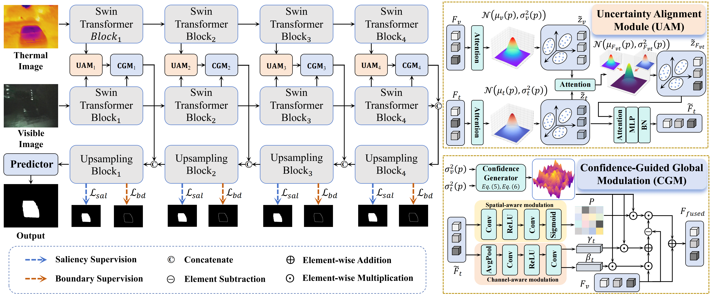

<div align="center">
  <h1>UMFNet</h1>
</div>

<div align="center">
<h4>[CVPR 2026] Uncertainty-Aware Modality Fusion for Unaligned RGB-T Salient Object Detection</h4>
</div>

<div align="center">
<h6>🌟 If this work is useful to you, please give this repository a Star! 🌟</h6>
</div>

<div align="center">
<h6>🌟 A refactored codebase is available, featuring a cleaner and lighter implementation, easier usage, and improved performance. 🌟</h6>
</div>

<div align="center">
  <a href="https://www.apache.org/licenses/"></a>
</div>

## 🛠️ Method Overview

<p align="center">
    
</p>

RGB-T salient object detection (SOD) typically assumes well-aligned image pairs. In practice, visible and thermal cameras have different fields of view and optics, resulting in **unaligned modality pairs** that severely degrade fusion quality. We propose **UMFNet**, which explicitly models per-modality uncertainty to handle spatial misalignment. Each modality's features are treated as a **Gaussian random variable**: uncertain (misaligned) regions produce high variance, which is then used to suppress unreliable cross-modal influence during fusion. Specifically, we introduce an **U**ncertainty-**A**ware **M**odule (**UAM**) that encodes RGB and thermal features as stochastic latent codes via reparameterization, and a **C**onfidence-**G**uided **M**odulation module (**CGM**) that converts uncertainty estimates into spatial confidence weights for selective cross-modal injection. Built on a dual Swin-B backbone with a progressive decoder, UMFNet achieves robust salient object detection under real-world unaligned conditions.


## 🕹️ Getting Started

#### Environment Setup

```bash
conda create -n UMFNet python=3.10 -y
conda activate UMFNet
pip install torch torchvision timm
pip install numpy opencv-python Pillow tqdm py-sod-metrics
```

Or install all dependencies at once:

```bash
pip install -r requirements.txt
```

#### Dataset Preparation

Set the following environment variables to point to your dataset roots:

```bash
export UMFNET_SOD_ROOT=/path/to/unaligned_datasets    # UVT20K, UVT2000, WeaklyAligned/
export UMFNET_RGBTSOD_ROOT=/path/to/aligned_datasets  # VT5000, VT1000, VT821
```

Supported datasets:

| Split | Dataset | Description |
|-------|---------|-------------|
| Unaligned | **UVT20K** | Large-scale unaligned RGB-T pairs |
| Unaligned | **UVT2000** | Unaligned RGB-T benchmark |
| Weakly aligned | **U-VT5000 / U-VT1000 / U-VT821** | Weakly aligned variants of classic benchmarks |
| Aligned (reference) | **VT5000 / VT1000 / VT821** | Standard aligned RGB-T SOD benchmarks |

#### Training

Download a pretrained [Swin-B](https://github.com/microsoft/Swin-Transformer) checkpoint, then run:

```bash
export UMFNET_PRETRAIN=/path/to/swin_base_patch4_window12_384_22k.pth
export UMFNET_TEST_RGB_ROOT=/path/to/test/RGB/
export UMFNET_TEST_DEPTH_ROOT=/path/to/test/T/
export UMFNET_TEST_GT_ROOT=/path/to/test/GT/

bash run_umfnet_train.sh
```


#### Evaluation

```bash
python UMFNet_test.py \
    --pth_path ./Results/Result_UMFNet/UMFNet_best.pth \
    --datasets UVT20K UVT2000 U-VT5000 U-VT1000 U-VT821 \
    --save_predictions \
    --save_root ./test_maps
```

Metrics reported: **S-measure (Sm)**, **E-measure (Em)**, **Weighted F-measure (Fw)**. A `metrics_summary.json` is written to the output directory.


## 🤝 Citation

Please cite our work if it is useful for your research.

```bibtex
@inproceedings{umfnet2026,
  title     = {Uncertainty-Aware Modality Fusion for Unaligned RGB-T Salient Object Detection},
  booktitle = {Proceedings of the IEEE/CVF Conference on Computer Vision and Pattern Recognition (CVPR)},
  year      = {2026},
}
```

## 🏷️ License

This project is released under the [Apache 2.0](https://www.apache.org/licenses/) license.
